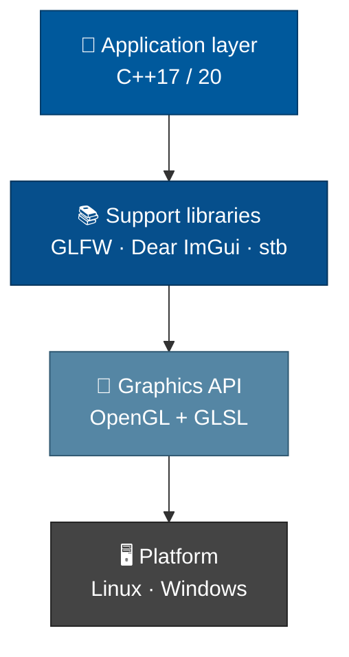
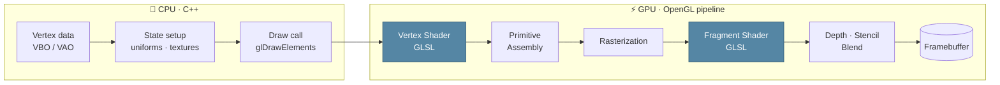
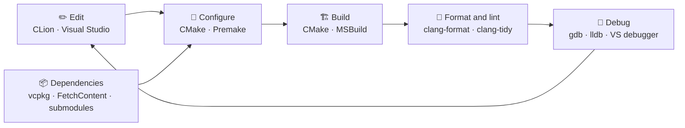
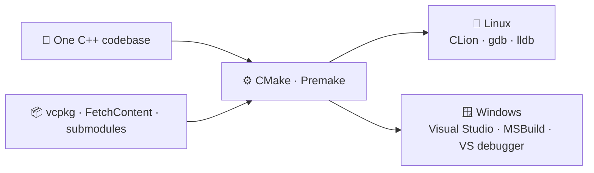
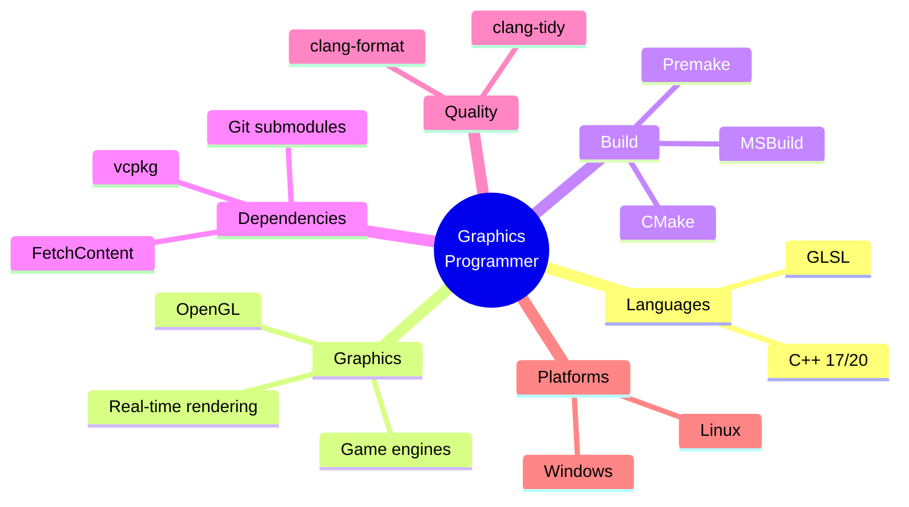
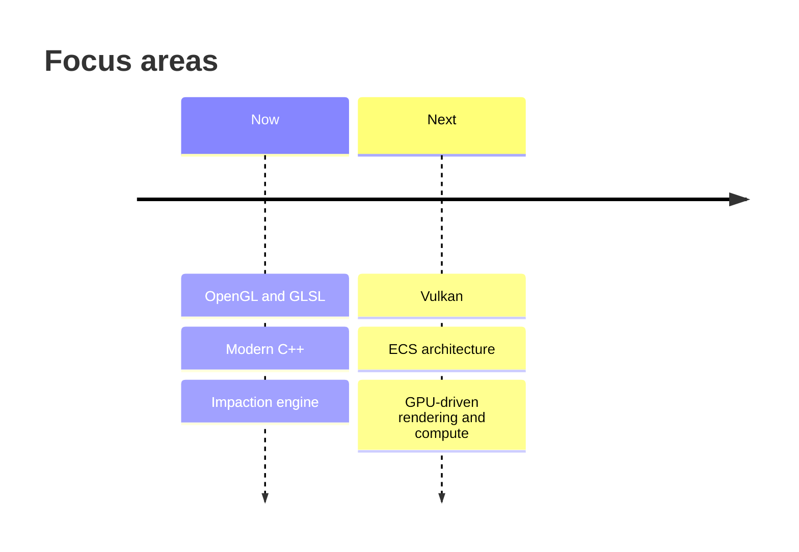

<h1 align="center">Hello, I am a Graphics Programmer 👋</h1>

  Modern C++ and GLSL, rendering in real time. 
  Building a cross-platform game engine to understand how everything fits together.

  

  
  
  
  

  <a href="#-featured-project-impaction">Project</a> ·
  <a href="#-stack-layers">Stack</a> ·
  <a href="#-rendering-pipeline">Pipeline</a> ·
  <a href="#-toolchain">Toolchain</a> ·
  <a href="#-workflow">Workflow</a> ·
  <a href="#-roadmap">Roadmap</a> ·
  <a href="#-contact">Contact</a>

---

## 👤 About

I'm a graphics programmer focused on **real-time rendering for games and engines**. My primary language is **C++ (17/20)**, and I'm comfortable taking a project from an empty directory to a buildable, cross-platform codebase, including build systems and dependency management.

| | |
|---|---|
| 🎯 **Focus** | Real-time rendering, game engine development |
| 💻 **Language** | C++ 17 / 20 |
| 🎨 **Graphics** | OpenGL + GLSL |
| 🖥️ **Platforms** | Linux (primary) and Windows |

---

## 🎮 Featured Project: Impaction

**[staticinl/Impaction](https://github.com/staticinl/Impaction)** is a **cross-platform game engine** written in C++ with **OpenGL** as the graphics API. I'm building it from scratch to learn engine architecture and graphics programming hands-on, so the repo doubles as a running record of that work.

  
  
  
  
  
  

> 👯 **Open to contributors.** If engine architecture, rendering, or graphics programming interests you, issues and PRs are welcome.

---

## 🧱 Stack Layers

---

## 🎞️ Rendering Pipeline

---

## 🛠️ Toolchain

### Build and dev flow

### Cross-platform build matrix

### Full reference

| Category | Tools |
|---|---|
| **Language** | C++ 17 / 20 |
| **Graphics API** | OpenGL |
| **Shaders** | GLSL |
| **Libraries** | GLFW, Dear ImGui, stb |
| **Build systems** | CMake, Premake, MSBuild |
| **Dependencies** | vcpkg, Git submodules, CMake FetchContent |
| **IDEs** | CLion, Visual Studio |
| **Debuggers** | gdb, lldb, Visual Studio debugger |
| **Code quality** | clang-format and  clang-tidy |
| **OS** | Linux and  Windows |

---

## 🔁 Workflow

I add features **incrementally**: get the smallest part on screen often break it on purpose and then and learn from the issue it causes.

---

## 🗺️ Skill Map

---

## 📈 Status Matrix

| Technology | Status |
|---|---|
| C++ 17 / 20 | ✅ Daily driver |
| OpenGL | ✅ In use (Impaction) |
| GLSL | ✅ In use |
| CMake · Premake · MSBuild | ✅ In use |
| vcpkg · FetchContent · submodules | ✅ In use |
| clang-format · clang-tidy | ✅ In use |
| Vulkan | 🌱 Learning next |
| ECS architecture | 🌱 Learning next |
| GPU-driven rendering / compute | 🌱 Learning next |

---

## 🚀 Roadmap

---

## 📫 Contact

- 📷 Instagram: https://instagram.com/staticinl
- 🎮 Discord: username-> staticinl
- 📧 Email: swapmit.13@gmail.com

---

<i>Follow along or contribute: <a href="https://github.com/staticinl/Impaction">staticinl/Impaction</a></i>

